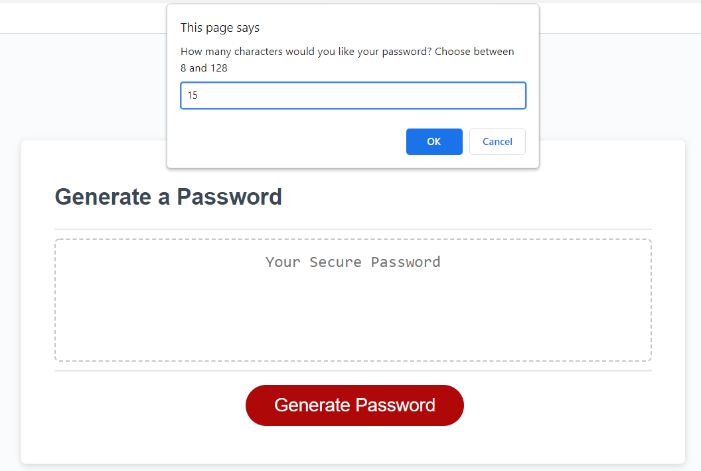
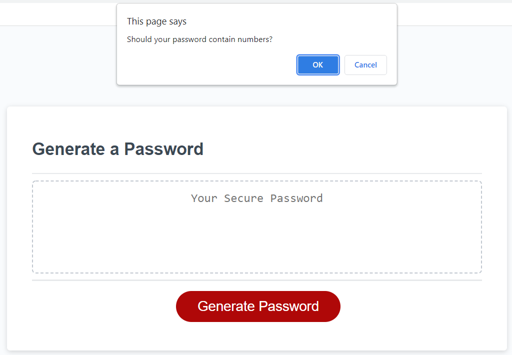
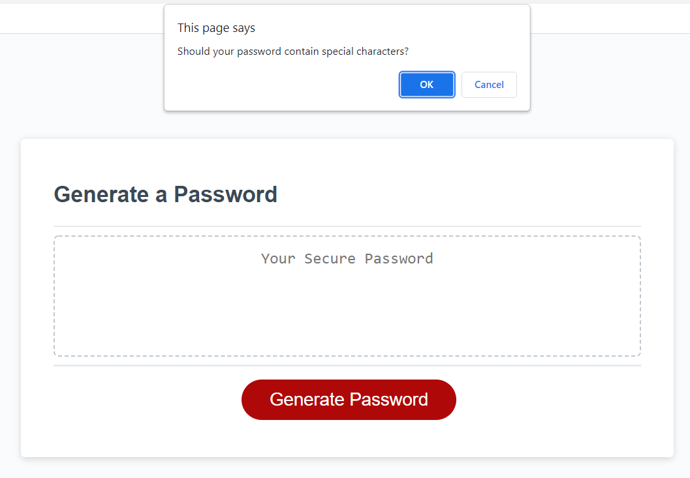
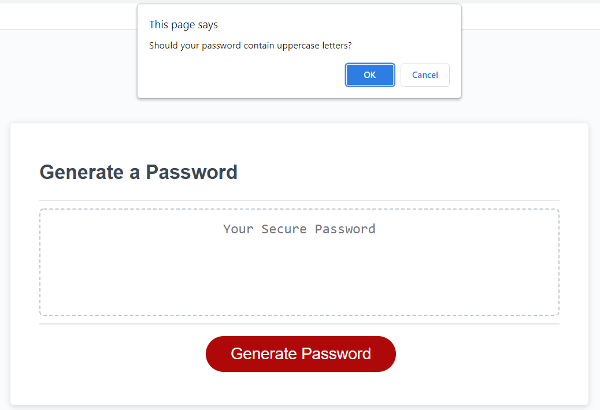
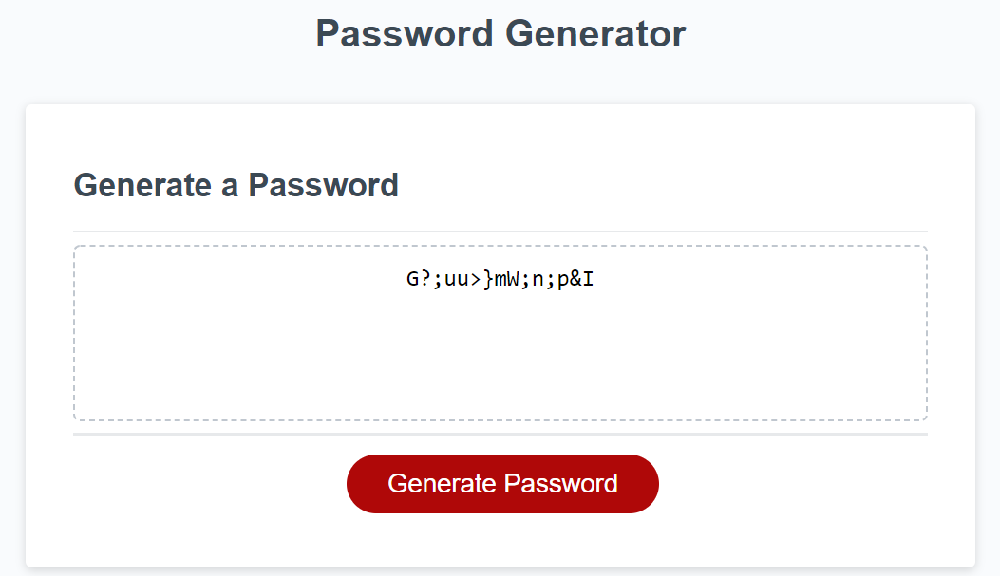

<h2>Dynamic Password Generator</h2>

I have created an application that enables a user to generate random passwords based on selected criteria. This app will run in the browser and will feature dynamically updated HTML and CSS powered by JavaScript code.

The user will have the opportunity to personalize their password by:

<ul>
    <li>Selecting no less than 8 and no more than 128 characters</li>
    <li>Confirming the use of numbers (0-9)</li>
    <li>Confirming the use of special characters (!#$%&'()*+,-./:;<=>?@[\\]^_`{|}~)</li>
    <li>Confirming the use of uppercase and/or lowercase letters (A-Z, a-z)</li>
</ul>
 
<h3> Demo of Password Generator</h3>

When the user clicks on the "Generate Password" button a user input prompt will appear

 

The user is asked to confirm the use of numbers

 

The user is asked to confirm the use of special characters

 

The user is asked to confirm the use of uppercase letters

 

The user is asked to confirm the use of lowercase letters

 

The random password is generated in the text area

 
<a href = "https://nparker80.github.io/Random-Password-Generator">Link to Password Generator</a>
 
 
<h2>Technoglogies Used</h2>
*HTML5
*CSS
*Vanilla JavaScript
 
 
MIT License

Copyright (c) 2021 Najla Parker

Permission is hereby granted, free of charge, to any person obtaining a copy
of this software and associated documentation files (the "Software"), to deal
in the Software without restriction, including without limitation the rights
to use, copy, modify, merge, publish, distribute, sublicense, and/or sell
copies of the Software, and to permit persons to whom the Software is
furnished to do so, subject to the following conditions:

The above copyright notice and this permission notice shall be included in all
copies or substantial portions of the Software.

THE SOFTWARE IS PROVIDED "AS IS", WITHOUT WARRANTY OF ANY KIND, EXPRESS OR
IMPLIED, INCLUDING BUT NOT LIMITED TO THE WARRANTIES OF MERCHANTABILITY,
FITNESS FOR A PARTICULAR PURPOSE AND NONINFRINGEMENT. IN NO EVENT SHALL THE
AUTHORS OR COPYRIGHT HOLDERS BE LIABLE FOR ANY CLAIM, DAMAGES OR OTHER
LIABILITY, WHETHER IN AN ACTION OF CONTRACT, TORT OR OTHERWISE, ARISING FROM,
OUT OF OR IN CONNECTION WITH THE SOFTWARE OR THE USE OR OTHER DEALINGS IN THE
SOFTWARE.
